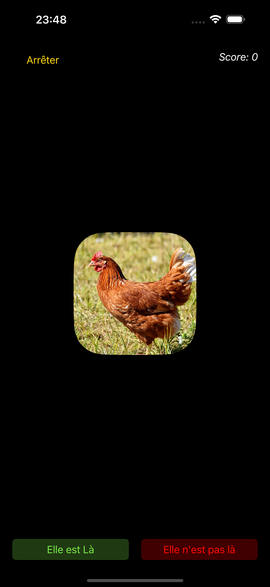

# **Where is the chicken ?** 

Ce jeu permet de déplacer l'image vert la gauche ou droite uniquement.  
Accorder un point à chaque victoire.  
Afficher si c'est gagné ou perdu et rien tant que le jeu n'a pas commenceé.  
L'écran est vert si l'image va au gauche, rouge s'il elle va à droite.  

</a>