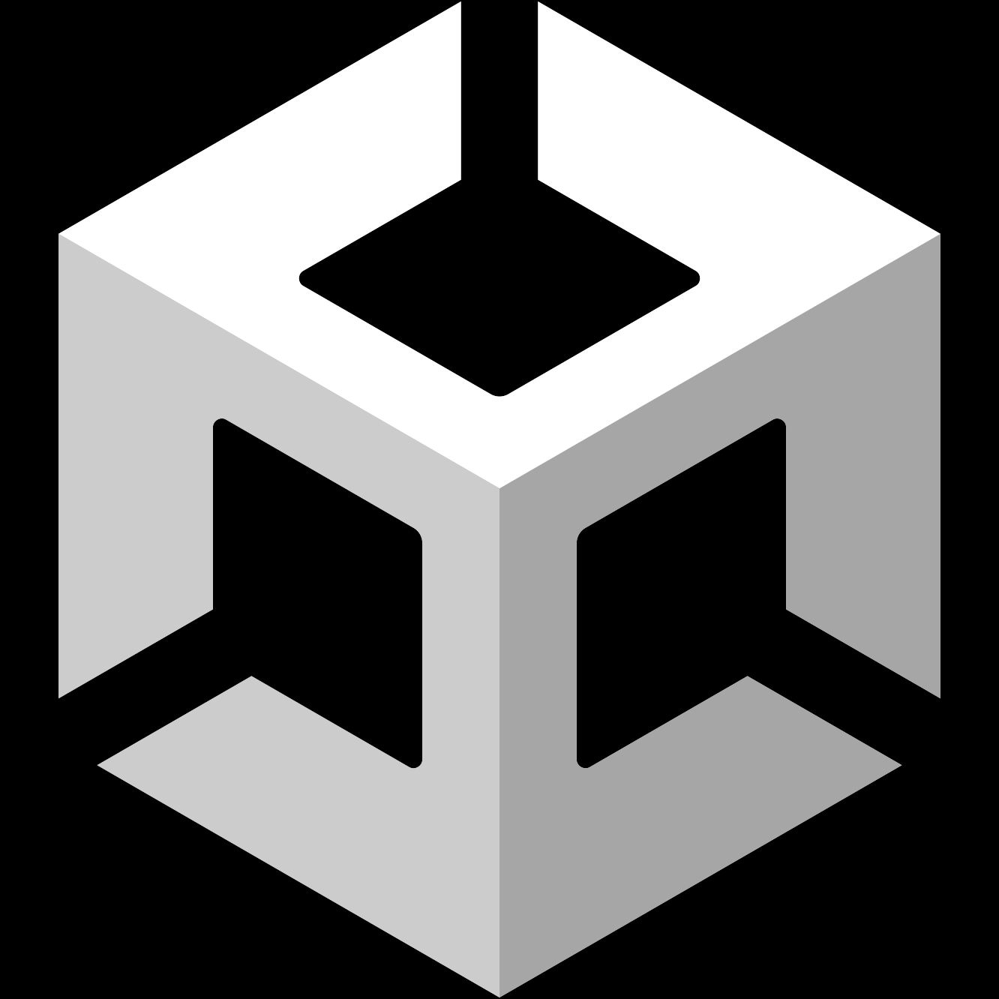

# **Développement d’applications**
## **Python** 
Python est un langage de programmation interprété, orienté objet, et de haut niveau.  

Connu pour sa simplicité de syntaxe, sa lisibilité et sa grande expressivité, permettant de développer rapidement des applications dans de nombreux domaines. Python dispose d’une vaste bibliothèque standard et d’une large communauté de développeurs, le rendant très polyvalent et populaire, notamment pour le web, la science des données et l’intelligence artificielle. Ses principales caractéristiques sont la dynamicité, la portabilité et l’extensibilité.  

### **Mini projets**
[Validateur de carte de crédit](https://github.com/MiKL5/Python/blob/master/miniProjets/creditCardValidator)  
[Calculatrice avec opérations multiples](https://github.com/MiKL5/Python/blob/master/miniProjets/calculator)  
[Conversion d’entier et de binaire](https://github.com/MiKL5/Python/blob/master/miniProjets/integerBinaryConversion)  
[Calcul d’addresse et de masque réseau](https://github.com/MiKL5/Python/blob/master/miniProjets/networkAdressMask)  
[L’année de naissance](https://github.com/MiKL5/Python/blob/master/miniProjets/ageAndYearOfBirth)  
[Liste de lecture](https://github.com/MiKL5/Python/blob/master/miniProjets/bookslist)  
[Liste de lecture dans un fichier CSV](https://github.com/MiKL5/Python/blob/master/miniProjets/booklist2)  
[Les 50 premiers nombres premier](https://github.com/MiKL5/Python/blob/master/miniProjets/ListPrimeNumber)  
[Dictionnaire de villes](https://github.com/MiKL5/Python/blob/master/miniProjets/dictionaryOfCities)  
[Gestion de personnages](https://github.com/MiKL5/Python/blob/master/miniProjets/characterManagement)  

    <h2><a href="https://github.com/MiKL5/Python"><b><i>➜ Tout voir</i></b></a></h2>

  

### **Projets avec Jupyter Notbook** 
> <h4>Apprentisage non supervisé</h4>

    <h2><a href="https://github.com/MiKL5/machineLearning"><b><i>➜ Aller voir</i></b></a></h2>

  

## **Swift** 
Rapide, sécurisé et facile à lire, il est conçu spécialement pour développer des applications pour les plateformes Apple.  

L’autre langage maison d’Apple est Objective-C. 

En travaillant sur Xcode [Chris LATTNER](https://fr.wikipedia.org/wiki/Chris_Lattner) voulait un langage moins contraignant pour les appareils tels que les iPhones et iPad.   
[Swift](https://fr.wikipedia.org/wiki/Swift_(langage_d%27Apple)) est un langage de programmation orienté objet à usage général créer en 2010 par Apple. Il est compilé et développer par Apple dans le but de créer des applis pour macOS, iOS, tvOS, WatchOS, visionOS, DriverKit…  
Il est simple, sûr performant, véloce et open source.  
Et est inspiré de nombreux langage come l’Objective-C, le Python, le C ou Java.

Apple est le principal contributeur étant le créateur, nonobstant, une communauté y contribue ainsi que d’importantes sociétés (e.g. IBM et Google).

Officiellement présenté à la WWDC de 2014 par Chris LATTNER, il est supporté par de nombreux OS, dont ceux d’Apple, Linux ainsi que des supports non officiels avec certaines plateformes.

### **Mini-projets**
1. PetBook
2. [Where is the chicken?](projects/whereIsTheChicken)
<!-- 3. FoodApp <kbd>_Wip_</kbd> -->

### **Exercice**
1. [Les intereactions avec l’utilisateur](exercises/howToInteract)

  

## **C#** 

[Pong](projects/pong)   
<!-- [Puissance4](projects/p4) <kbd>_**Wip**_</kbd>    -->
<!-- [Taxi autonome](projects/practice1) **_<kbd>Soon</kbd>_**    -->
<!-- [Casse-briques](projects/brickBreaker) **_<kbd>Soon</kbd>_**    -->